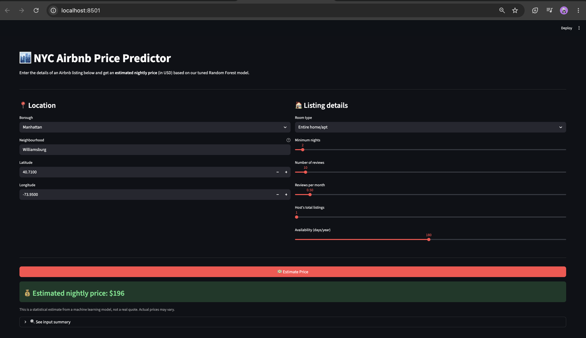
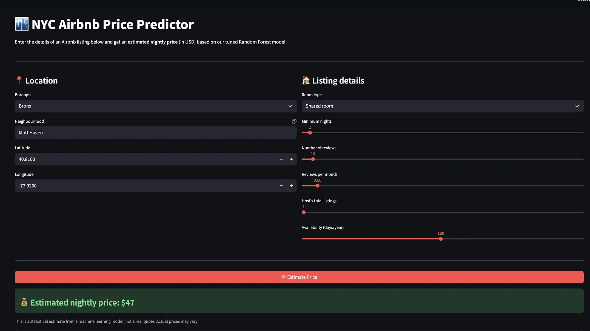

# NYC Airbnb Price Prediction

**DS605: Fundamentals of Machine Learning — Lab Assignment 4**

**Name:** Hitesh
**Roll Number:** 202618040

An end-to-end machine learning project that predicts the nightly price of an Airbnb listing in New York City, with a Streamlit web app for users to try it out.

---

## 📌 Objective

Build a complete ML workflow — data cleaning, EDA, feature engineering, model training, tuning, and deployment.

- **Dataset:** [Kaggle NYC Airbnb Open Data (AB_NYC_2019)](https://www.kaggle.com/datasets/dgomonov/new-york-city-airbnb-open-data)
- **Target:** `price` (nightly rate in USD)
- **Size:** 48,895 listings × 16 columns

---

## 📊 Key EDA Findings

- Price is **heavily right-skewed** → used `log1p(price)` as target.
- **Room type** strongly affects price: Entire home ($160) ≫ Private ($70) ≫ Shared ($45).
- **Borough** matters: Manhattan ($150) ≫ Brooklyn ($90) ≫ Bronx ($65).
- **Location** (latitude + longitude) is a strong predictor.
- Reviews have almost **no correlation** with price.

---

## 🧹 Data Cleaning

- Dropped `id`, `host_id`, `host_name`, `name`, `last_review`.
- Removed 11 listings with `price = 0`.
- Filled missing `reviews_per_month` with **0** (means "no reviews yet").
- Clipped outliers in `price`, `minimum_nights`, `calculated_host_listings_count` at the 99th percentile.
- Created `price_log = log1p(price)` as the modeling target.

---

## ⚙️ Preprocessing Pipeline

All steps are inside a single `sklearn` Pipeline so training and inference are consistent:

| Feature group | Columns | Transformation |
|---|---|---|
| Numeric | latitude, longitude, minimum_nights, number_of_reviews, reviews_per_month, calculated_host_listings_count, availability_365 | Imputer + StandardScaler |
| Low-cardinality categorical | neighbourhood_group, room_type | Imputer + OneHotEncoder |
| High-cardinality categorical | neighbourhood (221 unique) | Imputer + TargetEncoder |

---

## 🤖 Model Comparison

| Model | Test R² | Test MAE ($) |
|---|---|---|
| Linear Regression | 0.552 | 52.36 |
| Ridge | 0.552 | 52.36 |
| Decision Tree | 0.567 | 50.92 |
| Gradient Boosting (tuned) | 0.619 | 48.15 |
| **Tuned Random Forest** ✅ | **0.625** | **47.56** |

**Final model:** Random Forest (`n_estimators=200, max_depth=25, max_features=log2, min_samples_split=5, min_samples_leaf=2`)

**Top 5 important features:**
1. `room_type = Entire home/apt` (23.8%)
2. `room_type = Private room` (15.1%)
3. `neighbourhood` (12.3%)
4. `longitude` (11.8%)
5. `latitude` (9.0%)

---

## 🖥️ Streamlit App

Interactive UI where you enter listing details and get an estimated nightly price.

**Test cases:**

| Input | Output |
|---|---|
| Manhattan / Entire home / Williamsburg | ~$196 |
| Bronx / Shared room / Mott Haven | ~$47 |

**Screenshots:**




---

## 📁 Project Structure

```
LAB04/
├── app/app.py                          # Streamlit app
├── data/AB_NYC_2019.csv                # raw dataset
├── docs/screenshots/                   # app screenshots
├── models/airbnb_price_pipeline.pkl.gz # saved pipeline
├── notebooks/airbnb_eda.ipynb          # EDA + modeling notebook
├── .gitignore
├── README.md
└── requirements.txt
```

---

## 🚀 How to Run

```bash
# 1. Clone the repo
git clone <your-repo-url>
cd LAB04

# 2. Create virtual environment
python -m venv venv
source venv/bin/activate          # macOS/Linux
# venv\Scripts\activate           # Windows

# 3. Install dependencies
pip install -r requirements.txt

# 4. Run the app
streamlit run app/app.py
```

Open `http://localhost:8501` in your browser.

---

## 🔗 Deployed App

**Live link:** *(add after deploying to Streamlit Cloud)*

---

## ⚠️ Limitations

- Dataset is from **2019** — prices have changed since then.
- Test R² = 0.625 → ~37% of price variance is not explained.
- No seasonality, amenities, photos, or host rating data.
- Model **under-predicts** luxury listings above $500.
- Predictions are statistical estimates, **not real quotes**.

---

## 👤 Author

**Hitesh** — Roll No. 202618040
DS605: Fundamentals of Machine Learning — Lab 4
